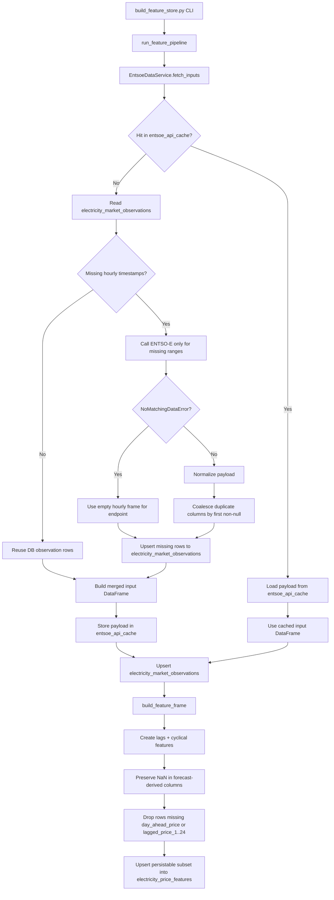

# Architecture Notes

This document is the quick architecture map. For full file-by-file implementation details, see `docs/developer_guide.md`.

## End-to-end data flow

1. `scripts/build_feature_store.py` parses CLI arguments and validates env vars.
2. It calls `pipeline.run_feature_pipeline(...)`.
3. `EntsoeDataService.fetch_inputs(...)` loads:
   - `day_ahead_price`
   - `load_forecast`
   - `wind_forecast`
   - `solar_forecast`
4. Each ENTSO-E call is wrapped by `cache_to_db(...)` and either:
   - serves a hit from `entsoe_api_cache`, or
   - falls back to `electricity_market_observations` for already-known timestamps,
   - and performs API calls only for missing hourly intervals.
5. Missing intervals returned from API are upserted into `electricity_market_observations`.
6. The final merged result is cached in `entsoe_api_cache`.
7. Raw merged series are upserted to `electricity_market_observations`.
8. `features.build_feature_frame(...)` computes:
   - `residual_load`
   - lagged arrays (24 values each)
   - cyclical encodings for hour/weekday/month
   - preserves `NaN` for missing forecast-derived values.
9. `pipeline.persist_feature_frame(...)` upserts model-ready rows to `electricity_price_features`.
   - filters out rows that violate feature-table NOT NULL constraints.

## Process diagram

## Key design reasons

- DB cache avoids repeated ENTSO-E calls during iterative model work.
- Observation-table fallback avoids re-fetching timestamps already persisted once.
- Pickled payloads preserve exact pandas object shape and index information.
- Feature table stores fixed-size lag arrays so one row corresponds to one prediction timestamp.
- Missing forecasts are kept as `NaN` in analysis outputs, avoiding misleading zero-imputation.
- Persistence layer enforces schema compatibility by skipping rows with nulls in NOT NULL feature columns.

## Extension points

- Add label/target tables (`t+1`, `t+24`, etc.).
- Add training metadata + model registry tables.
- Add partitioning strategy for multi-year production-scale data.
