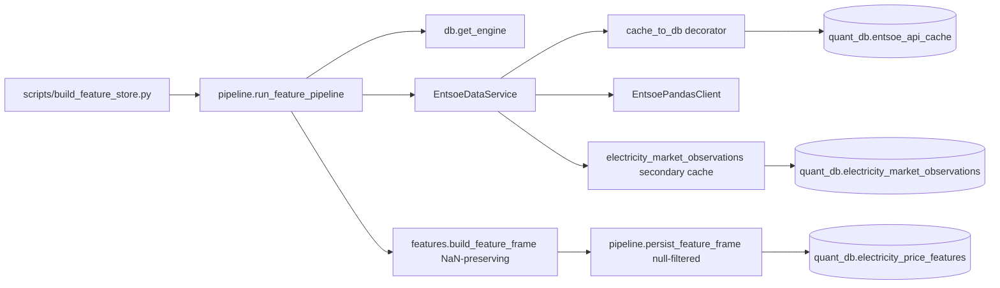
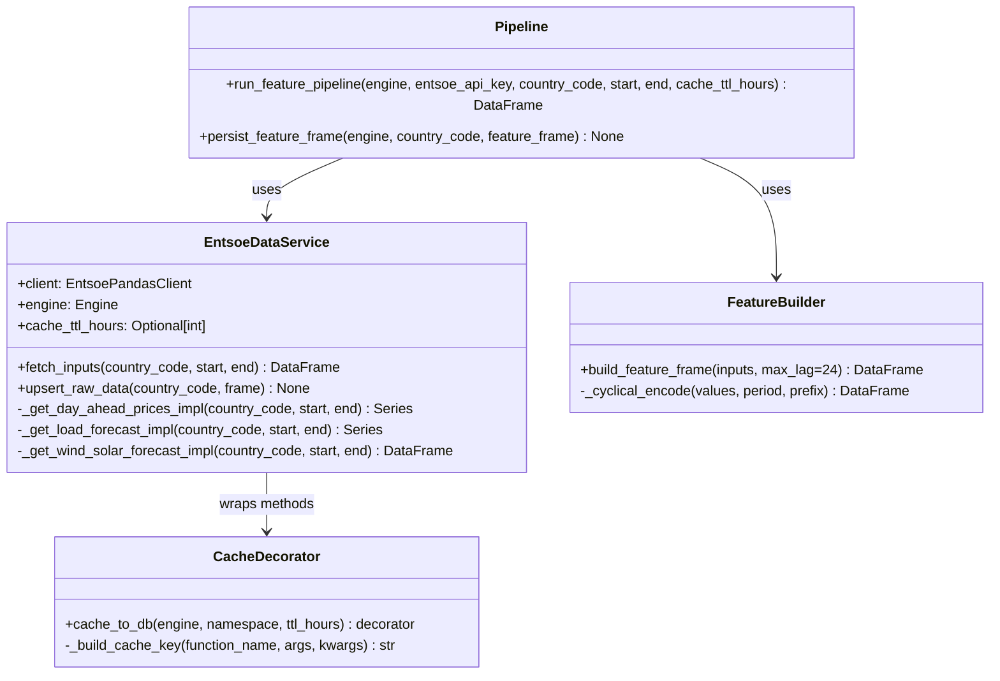
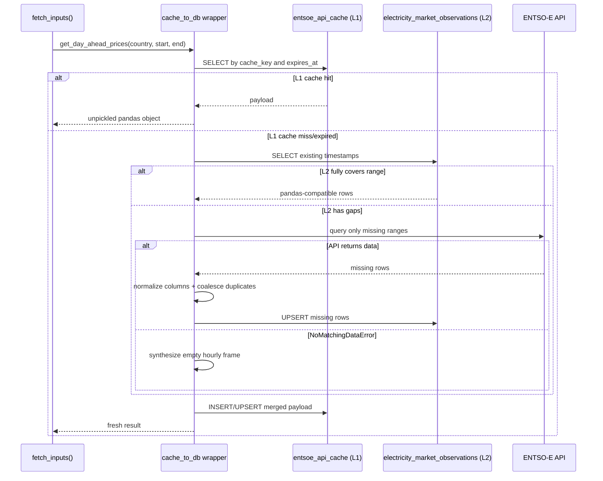
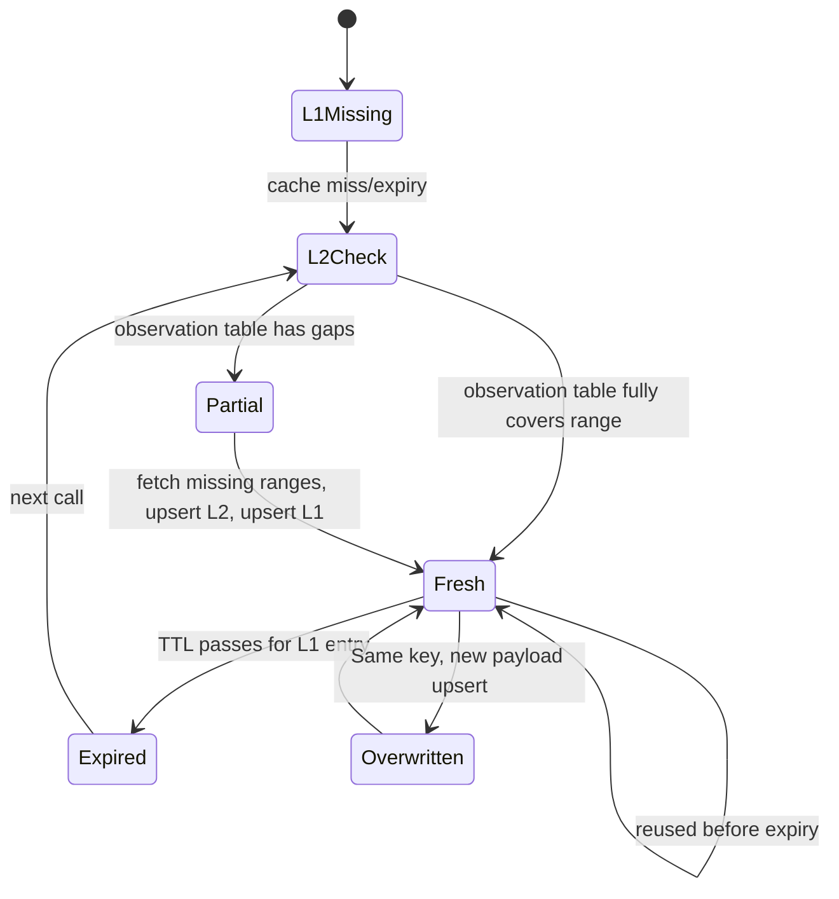
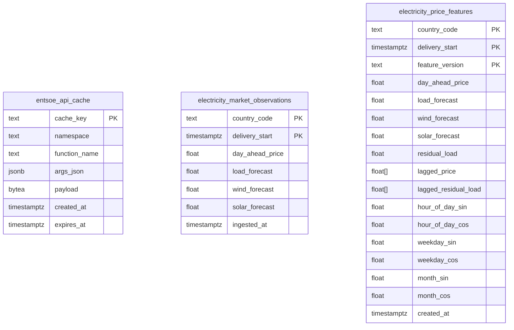

# Developer Guide (Deep Dive)

This guide explains each file in the module, execution order, control flow, and data/state transitions so you can reason about behavior without reading source code.

## 1) Directory map and responsibilities

### Top-level

- `requirements.txt`
  - Python dependencies for ingestion and DB persistence.
- `README.md`
  - Operator-focused setup and run commands.
- `sql/001_electricity_price_schema.sql`
  - DDL for cache, raw observations, and feature store.
- `scripts/init_db.py`
  - Applies the SQL schema to `quant_db`.
- `scripts/build_feature_store.py`
  - CLI entrypoint for data fetch + feature persistence.
- `docs/architecture.md`
  - High-level architecture summary.
- `docs/developer_guide.md`
  - This detailed developer-facing explanation.

### Python package (`src/electricity_price_predictor`)

- `__init__.py`
  - Public package exports (`get_engine`, `EntsoeDataService`, `build_feature_frame`).
- `db.py`
  - Builds DB URL from env vars and creates SQLAlchemy `Engine`.
- `cache.py`
  - Implements decorator-based DB cache with deterministic keying.
- `entsoe_api.py`
  - Wraps ENTSO-E API calls, normalizes data, and writes raw observations.
- `features.py`
  - Pure feature engineering logic (residual load, lags, cyclical encoding).
- `pipeline.py`
  - Orchestration layer for end-to-end fetch -> raw persist -> feature build -> feature persist.

## 2) Runtime execution path (step-by-step)

When you run:

```bash
PYTHONPATH=src python3 scripts/build_feature_store.py --country-code ... --start ... --end ...
```

Execution sequence:

1. **Argument parsing**
   - `build_feature_store.py` reads country code/time range/TTL.
2. **Credential/connection bootstrap**
   - checks `ENTSOE_API_KEY`.
   - calls `get_engine()` from `db.py`.
3. **Pipeline orchestration**
   - `run_feature_pipeline(...)` in `pipeline.py` starts.
4. **API service creation**
   - initializes `EntsoePandasClient`.
   - creates `EntsoeDataService(client, engine, cache_ttl_hours)`.
5. **Decorator wrapping**
   - in `EntsoeDataService.__post_init__`, API methods are wrapped by `cache_to_db(...)`.
6. **Data retrieval**
   - `fetch_inputs(...)` calls:
     - `get_day_ahead_prices(...)`
     - `get_load_forecast(...)`
     - `get_wind_solar_forecast(...)`
   - country aliases are normalized to bidding zones before queries (currently `DE -> DE_LU`, `IT -> IT_NORD`).
7. **Cache check/compute loop (per call)**
   - decorator computes hash key from function + args.
   - if non-expired row exists in `entsoe_api_cache`: returns payload.
   - else: reads `electricity_market_observations` for requested timestamps.
   - if timestamps are missing there, only missing hourly ranges are requested from ENTSO-E.
   - `NoMatchingDataError` from ENTSO-E is converted to an empty hourly frame for that endpoint/range.
   - normalized responses coalesce duplicate semantic columns (for example multiple wind/solar columns) via first non-null-per-row.
   - missing rows are upserted into `electricity_market_observations`.
   - final merged dataset is stored in `entsoe_api_cache` and returned.
8. **Raw persistence**
   - merged inputs are upserted to `electricity_market_observations`.
9. **Feature engineering**
   - `build_feature_frame(...)` computes:
     - `residual_load = load - wind - solar`
     - `lagged_price_1..24`
     - `lagged_residual_load_1..24`
     - `hour_of_day_sin/cos`, `weekday_sin/cos`, `month_sin/cos`
   - preserves source missingness as `NaN` (no 0.0 imputation).
   - drops rows only when `day_ahead_price` / `lagged_price_1..24` are missing (lag warmup requirement).
10. **Feature-store persistence**
    - lags are materialized into PostgreSQL arrays (`DOUBLE PRECISION[]`, length 24).
   - rows violating NOT NULL core feature constraints are filtered out before upsert.
   - persistable rows are upserted to `electricity_price_features`.
11. **CLI completion**
    - prints persisted row count.

## 3) UML diagrams

## 3.1 Component diagram



## 3.2 Class diagram (logical)



## 3.3 Sequence diagram (single API method with cache)



## 3.4 State diagram (cache entry lifecycle)



## 3.5 ER diagram (database schema)



## 4) How files collaborate

## 4.1 `db.py` + scripts

- Scripts never hardcode DB URI; they call `get_engine()`.
- `get_engine()` centralizes environment-driven connectivity.

## 4.2 `cache.py` + `entsoe_api.py`

- `cache_to_db()` is generic and independent of ENTSO-E specifics.
- `EntsoeDataService.__post_init__` binds that generic decorator to each API-fetch method.
- Result: all expensive API calls automatically become cache-aware without changing call sites.

## 4.3 `entsoe_api.py` + `features.py`

- `entsoe_api.py` guarantees normalized timestamp index and expected source columns.
- `features.py` assumes these columns and transforms them to model features only (no DB side effects).

## 4.4 `features.py` + `pipeline.py`

- `build_feature_frame()` returns wide DataFrame with `lagged_*_1..24`.
- `persist_feature_frame()` converts those to PostgreSQL arrays so table rows stay compact and versioned.

## 5) Important implementation details

- **Cache keys are deterministic**
  - Built from JSON of function name + args + kwargs with stable sorting.
- **Cache payload type**
  - `pickle` stored in `BYTEA` to preserve pandas objects.
- **TTL logic**
  - `expires_at IS NULL` means never expires.
  - Otherwise must be greater than current UTC time to be considered valid.
- **Two-layer cache order**
  - Layer 1: `entsoe_api_cache` (function-result cache).
  - Layer 2: `electricity_market_observations` (timestamp-level raw cache).
  - API calls happen only for Layer-2 gaps.
- **Upsert strategy**
  - Raw and feature tables use `ON CONFLICT ... DO UPDATE` for idempotent reruns.
  - Raw upsert uses `COALESCE(EXCLUDED.col, existing.col)` to avoid null-overwriting previously stored values during partial refreshes.
  - Feature upsert operates on a filtered persistable subset where core NOT NULL columns are present.
- **Missingness semantics**
  - Forecast and derived residual columns preserve `NaN` in memory.
  - No zero-imputation is performed for missing forecast values.
- **Bidding-zone normalization**
  - `resolve_bidding_zone_code(...)` maps common country aliases to ENTSO-E zone codes.
  - Pipeline persistence uses the resolved code, ensuring DB keys match actual queried zones.
- **Timezone handling**
  - API index is normalized to UTC to avoid DST ambiguity in lag features.
- **Feature warmup**
  - Rows missing `day_ahead_price` or any `lagged_price_1..24` are dropped because lag history is incomplete.

## 6) Failure modes and expected behavior

- Missing `ENTSOE_API_KEY` -> CLI raises early runtime error.
- Missing required input columns -> feature builder raises `ValueError`.
- Duplicate normalized columns from ENTSO-E payloads -> coalesced before reindexing to avoid pandas duplicate-label reindex errors.
- ENTSO-E no-data responses for an endpoint/range -> transformed to empty hourly frames and merged safely.
- Empty data frame -> raw/feature persistence functions no-op safely.
- Repeated identical request -> cache hit (no API roundtrip).
- Expired L1 cache row + full L2 coverage -> no API call required.
- Expired L1 cache row + partial L2 coverage -> API called only for missing ranges.

## 7) Data contracts

### 7.1 In-memory features contract

Producer: `run_feature_pipeline(...)` return value (`pd.DataFrame`).

- **Index contract**
  - hourly UTC `DatetimeIndex`, sorted ascending.
  - unique timestamps expected after deduplication.
- **Column contract**
  - base: `day_ahead_price`, `load_forecast`, `wind_forecast`, `solar_forecast`
  - derived: `residual_load`
  - lag columns: `lagged_price_1..24`, `lagged_residual_load_1..24`
  - cyclical: `hour_of_day_sin/cos`, `weekday_sin/cos`, `month_sin/cos`
- **Nullability contract**
  - required non-null in returned rows: `day_ahead_price`, `lagged_price_1..24`
  - nullable: `load_forecast`, `wind_forecast`, `solar_forecast`, `residual_load`, and `lagged_residual_load_*`
  - rationale: preserve upstream missingness semantics for analysis and QC.

### 7.2 Feature-store persistence contract

Consumer: `electricity_price_features` table.

- **Primary key contract**
  - (`country_code`, `delivery_start`, `feature_version`)
- **Schema constraint contract**
  - core numeric columns are `NOT NULL`.
  - lag arrays are `DOUBLE PRECISION[]` and expected length 24.
- **Write-time contract**
  - `persist_feature_frame(...)` filters rows that violate NOT NULL core columns before UPSERT.
  - retained rows are idempotently upserted via `ON CONFLICT ... DO UPDATE`.

### 7.3 Raw-observation contract

Consumer: `electricity_market_observations` table.

- **Primary key contract**
  - (`country_code`, `delivery_start`)
- **Merge contract**
  - upsert uses `COALESCE(EXCLUDED.col, existing.col)` to avoid null-overwriting prior known values.
- **Coverage contract**
  - secondary cache guarantees fetched payloads are aligned to expected hourly index for the requested `[start, end)` range.

## 8) Practical debugging checklist

1. Run `scripts/init_db.py` and ensure tables exist.
2. Run one short-range fetch window (1-2 days) first.
3. Verify cache growth:
   - `SELECT namespace, function_name, COUNT(*) FROM entsoe_api_cache GROUP BY 1,2;`
4. Verify raw persistence:
   - `SELECT COUNT(*) FROM electricity_market_observations WHERE country_code = '...';`
5. Verify feature persistence:
   - check lag array sizes are 24 and row count is lower than raw by about 24.

## 9) Suggested next developer docs to add

- Data quality rules (acceptable missingness, clipping policy, anomaly handling).
- Training-set contract (target definition, split strategy, leakage constraints).
- Backfill/replay policy for reprocessing historical periods.
